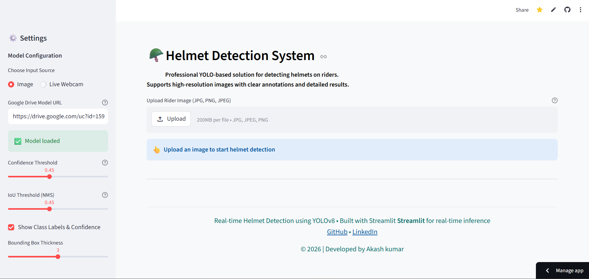
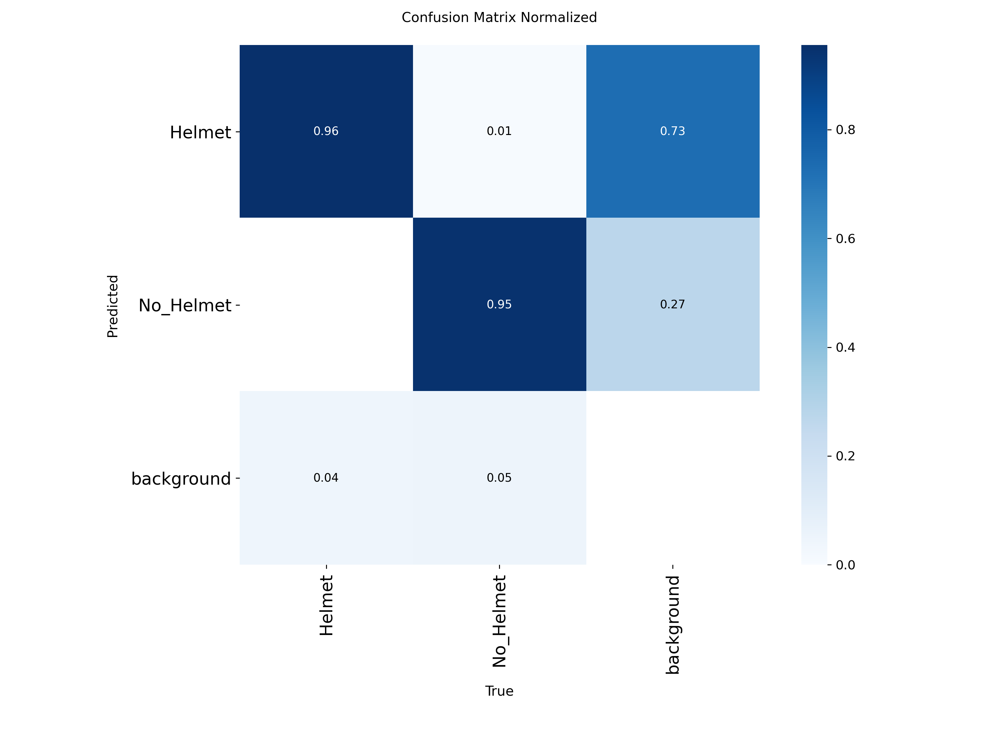

# 🪖 Helmet Detection System
### AI-Powered Safety Compliance Monitoring using YOLOv8 + Streamlit

<div align="center">


**[🚀 Live Demo](#)** • **[📖 Documentation](#)** • **[🐛 Report Bug](#)** • **[💡 Request Feature](#)**

> ⚠️ **TODO:** Replace `#` links above with your actual GitHub Pages / Streamlit Cloud / Hugging Face Spaces deployment URL and issue tracker links.

</div>

---

## 📋 Table of Contents

- [Overview](#-overview)
- [Problem Statement](#-problem-statement)
- [Solution](#-proposed-solution)
- [Demo](#-demo)
- [Features](#-key-features)
- [Architecture](#-system-architecture)
- [Technologies](#-technologies-used)
- [Dataset](#-dataset)
- [Installation](#-installation--setup)
- [Usage](#-usage)
- [Model Performance](#-model-performance)
- [Project Structure](#-project-structure)
- [Roadmap](#-roadmap)
- [Contributing](#-contributing)
- [License](#-license)

---

## 📌 Overview

The **Helmet Detection System** is an AI-powered web application designed to automatically detect whether individuals are wearing safety helmets or not. Built on top of **Ultralytics YOLOv8** and deployed via a **Streamlit** interactive interface, this system provides real-time inference with minimal setup.

It is designed for industries where personal protective equipment (PPE) compliance is legally and ethically mandatory.

---

## 🎯 Problem Statement

| Industry | Challenge |
|---|---|
| 🏗️ Construction Sites | Manual helmet checks are impractical at scale |
| 🏭 Manufacturing Plants | Human fatigue leads to missed violations |
| 🚧 Road & Traffic Monitoring | No real-time automated enforcement exists |

**Core Pain Points:**
- Manual monitoring is slow, costly, and error-prone
- Violations often go undetected until an incident occurs
- No centralized dashboard to track safety compliance over time

---

## 💡 Proposed Solution

This project addresses the above challenges with a fully automated AI pipeline:

```
Worker/Site Camera Feed
        ↓
  Frame Extraction
        ↓
  YOLOv8 Inference
        ↓
  Bounding Box Annotation (Helmet ✅ / No Helmet ❌)
        ↓
  Streamlit Dashboard (Stats, Alerts, Downloads)
```

**Why YOLOv8?**
- State-of-the-art real-time object detection
- Lightweight enough to run on CPU or edge devices
- Easily fine-tunable on custom datasets

---

## 🎬 Demo

> ⚠️ **TODO:** Add screenshots or a GIF of your running application here.  
> Example structure:



You can record a demo GIF using tools like [ScreenToGif](https://www.screentogif.com/) or [Peek (Linux)](https://github.com/phw/peek) and upload it to your `assets/` folder.

---

## 🧠 Key Features

| Feature | Description |
|---|---|
| ⚡ Fast Inference | Real-time detection using YOLOv8 nano/small models |
| 🎯 Dual-Class Detection | Accurately classifies `Helmet` and `No Helmet` |
| 🖥️ Interactive Web UI | Clean Streamlit interface — no frontend coding needed |
| 📊 Detection Dashboard | Live counts, confidence scores, and violation summaries |
| 📥 Export Results | Download annotated images with one click |
| 📡 Webcam Support | Live detection from your local webcam (local deployment) |
| 🔔 Alert System | *(Planned)* Email/SMS alerts on violation detection |
| 🗂️ Batch Processing | *(Planned)* Upload and analyze multiple images at once |

---

## 🏗️ System Architecture

```
┌─────────────────────────────────────────────────────┐
│                    User Interface                    │
│              (Streamlit Web Application)             │
├────────────┬────────────────────┬───────────────────┤
│ Image Mode │   Webcam Mode      │  Video Upload Mode │
└────────────┴────────────┬───────┴───────────────────┘
                          │
                ┌─────────▼─────────┐
                │   Preprocessing   │
                │  (OpenCV Resize,  │
                │   Normalization)  │
                └─────────┬─────────┘
                          │
                ┌─────────▼─────────┐
                │  YOLOv8 Inference │
                │  (Custom Trained  │
                │     Weights)      │
                └─────────┬─────────┘
                          │
              ┌───────────┴──────────┐
              │                      │
     ┌────────▼────────┐   ┌────────▼────────┐
     │  Helmet ✅       │   │  No Helmet ❌    │
     │  Green BBox     │   │  Red BBox +      │
     │                 │   │  Violation Alert │
     └────────┬────────┘   └────────┬────────┘
              └───────────┬──────────┘
                          │
                ┌─────────▼─────────┐
                │  Output Dashboard │
                │  Stats + Download │
                └───────────────────┘
```

---

## 🧪 Technologies Used

| Component | Technology | Version |
|---|---|---|
| Object Detection Model | [Ultralytics YOLOv8](https://github.com/ultralytics/ultralytics) | `8.x` |
| Backend Language | Python | `3.8+` |
| Web Framework | [Streamlit](https://streamlit.io/) | `1.x` |
| Image Processing | [OpenCV](https://opencv.org/) | `4.x` |
| Data Manipulation | NumPy / Pandas | Latest |
| Visualization | Matplotlib / Plotly | Latest |
| Cloud IDE / Workspace | [Lightning AI Studio](https://lightning.ai/) | Latest |
| Deployment | Streamlit Cloud| — |

---

## 📦 Dataset

### Source Dataset

| Field | Details |
|---|---|
| 📛 Name | Safety Helmet Detection Dataset |
| 👤 Author | [archisman24](https://www.kaggle.com/archisman24) |
| 🌐 Platform | Kaggle |
| 🔗 Link | [🔗 Open Dataset](https://www.kaggle.com/datasets/archisman24/new-dataset) |
| 📄 Format | YOLO annotation format (`.txt` labels) |
| 🏷️ Classes | `Helmet` ✅, `No Helmet` ❌ |
| 📜 License | Check dataset page before commercial use |

---


### 📈 Dataset Split & Distribution

> ⚠️ *Note: Exact values are computed after preprocessing and may vary depending on dataset version and splitting strategy.*

| Split       | Images    | Helmet | No Helmet |
|------------|----------|--------|-----------|
| Train      | 19,000+  | XXXX   | XXXX      |
| Validation | 5,600+   | XXXX   | XXXX      |
| Test       | 2,800+   | XXXX   | XXXX      |

---

### Labeling Format
- **Total Images:** ~28,000  
- **Format:** YOLO `.txt` annotation format
- **Classes:** `0 = Helmet`, `1 = No Helmet`
- **Tool Used:** [lable studio](https://labelstud.io/) *(recommended)* or LabelImg

---

---

## ⚙️ Installation & Setup

Follow these steps to run the project locally on your system.

---

### 🔹 Step 1 — Clone the Repository

```bash
https://github.com/akashkumar223570/Helmet_dection_system.git
cd Helmet_dection_system
```
---

### 🔹 Step 2 — Create a Virtual Environment *(Recommended)*

```bash
python -m venv venv
```

**Activate it:**

▶️ **Windows:**
```bash
venv\Scripts\activate
```

▶️ **macOS / Linux:**
```bash
source venv/bin/activate
```

---

### 🔹 Step 3 — Install Dependencies

```bash
pip install -r requirements.txt
```

---

### 🔹 Step 4 — Add Your Trained Model Weights

Place your trained YOLOv8 weights file inside the `models/` directory:

```
models/
└── best.pt        ← your trained weights go here
```

>   [Google Drive](https://drive.google.com/uc?id=159gW7pS_WqHYcshw11kdF9TknvCLV5zb)   direct download link here.

---

### 🔹 Step 5 — Run the Application

```bash
streamlit run app.py
```

---

### 🔹 Step 6 — Open in Browser

After running, you will see this in your terminal:

```
  Local URL:  http://localhost:8501
  Network URL: http://YOUR_IP:8501
```

Open **http://localhost:8501** in your browser and the app is ready to use. ✅

---
## 🚀 Usage

### Image Detection
1. Open the app in your browser
2. Select **"Image Upload"** mode from the sidebar
3. Upload any `.jpg`, `.jpeg`, or `.png` file
4. View detections, confidence scores, and summary statistics
5. Download the annotated image

## 📊 Model Performance

> ⚠️ **TODO:** Fill in your actual metrics after training and evaluation. Run `yolo val` to get these numbers.

| Metric | Value |
|---|---|
| mAP@0.5 | 94.7% |
| mAP@0.5:0.95 | 61.9% |
| Precision | 91.5% |
| Recall | 91.7% |
| Model Size | ~21.5 MB |

---

### 📖 Understanding the Metrics

#### 🎯 What is mAP?

**mAP = Mean Average Precision** — the standard benchmark for measuring object detection quality.

It measures how well your model detects objects correctly.

It combines two things:

| Term | Question it answers |
|---|---|
| **Precision** | Out of all predicted objects, how many are correct? |
| **Recall** | Out of all actual objects, how many did model detect? |

---

#### 🔍 What is IoU (Intersection over Union)?
How much the **predicted bounding box** overlaps with the **actual (ground truth) box**.

```
         ┌──────────────┐
         │  Ground Truth│
         │    ┌─────────┼────────┐
         │    │ Overlap │        │  ← IoU = Overlap Area
         └────┼─────────┘        │          ──────────────
              │   Predicted Box  │       Union of both boxes
              └──────────────────┘
```

- **IoU = 1.0** → Perfect overlap (prediction matches exactly)
- **IoU = 0.5** → 50% overlap (acceptable)
- **IoU = 0.95** → 95% overlap (near perfect, very strict)

---

#### 🚀 mAP@0.5 — **94.7%** 🔥

> *"At least 50% box overlap = correct detection"*

- IoU threshold is set at **0.50**
- If predicted box overlaps actual box by ≥ 50% → counted as ✅ correct
- **94.7%** of this model's detections meet this bar
- This is considered **excellent** for a safety detection system

---

#### 📊 mAP@0.5:0.95 — **61.9%** ✅

> *"Average accuracy tested across many strictness levels"*

The model is evaluated at **10 different IoU thresholds**:

```
0.50 → 0.55 → 0.60 → 0.65 → 0.70 → 0.75 → 0.80 → 0.85 → 0.90 → 0.95
Easy ←————————————————————————————————————————————————→ Very Strict
```

- At **0.50** → easy, 50% overlap is enough
- At **0.95** → very strict, nearly perfect box placement required
- **61.9%** is the *average* across all 10 levels — a solid score

---

#### ✅ Precision — **91.5%**

> *"Out of all predicted objects, how many are correct?"*

```
Precision = True Positives / (True Positives + False Positives)
```

- **91.5%** means only **8.5%** of predictions were wrong (false alarms)
- Very low false positive rate ✅

---

#### 🔍 Recall — **91.7%**

> *"Out of all actual objects, how many did model detect?"*

```
Recall = True Positives / (True Positives + False Negatives)
```

- **91.7%** means the model missed only **8.3%** of real helmets
- Very low miss rate ✅

---

### 🎓 Real-Life Analogy

Think of it like an **exam grading system**:

| Metric | Analogy | Your Score |
|---|---|---|
| mAP@0.5 | Passing marks = 50% (lenient exam) | **94.7%** 🔥 |
| mAP@0.5:0.95 | Passing marks = 90% (very strict exam) | **61.9%** ✅ |
| Precision | How often your answers are right | **91.5%** ✅ |
| Recall | How many questions you attempted correctly | **91.7%** ✅ |

> 💡 A mAP@0.5 of **94.7%** is considered **production-ready** for real-world safety monitoring systems.

---

### Confusion Matrix



## 📊 Confusion Matrix Analysis

### ✅ 1. Diagonal Elements (Correct Predictions)

The diagonal values in the confusion matrix represent **correct classifications (True Positives)**.

| Class       | Value | Interpretation |
|------------|------|----------------|
| Helmet     | 0.96 | 96% of helmet instances are correctly detected |
| No Helmet  | 0.95 | 95% of no-helmet instances are correctly detected |

🔥 **Interpretation:**  
The model demonstrates **high classification accuracy** for both classes, indicating strong detection capability.

---

### ❌ 2. Off-Diagonal Elements (Misclassifications)

Off-diagonal values represent **incorrect predictions (errors)**.

#### 🔴 Example 1  
**Helmet → No Helmet = 0.01**

- 1% of helmet instances are misclassified as *No Helmet*  
- This is a **very low error rate**, indicating reliable classification  

---

#### 🔴 Example 2  
**No Helmet → Helmet (small value)**

- Some no-helmet instances are incorrectly predicted as *Helmet*  

⚠️ **Critical Insight:**  
This type of error is important in safety applications, as it may result in **missed violations**.

---

### ⚠️ 3. Background Class (Important in Object Detection)

In object detection tasks, **Background** refers to regions where **no object is present**.

#### 🔴 Case A: Background → Helmet
- The model predicts a helmet where no object exists  
- This is a **False Positive**

---

#### 🔴 Case B: Background → No Helmet
- The model predicts no-helmet where no object exists  
- Also considered a **False Detection (False Positive)**

---

#### 🔴 Case C: Object → Background
- The model fails to detect an actual object  
- This is a **False Negative (Missed Detection)**

---

### ⚠️ Clarification on Background Interpretation

The earlier statement:

> "73% background cases are wrongly predicted as helmet"

❌ This interpretation is misleading.

✔ **Correct Understanding:**  
Such values typically indicate **relative proportions of prediction errors**, not that 73% of all background images are misclassified. It reflects **model confusion between object and background regions**.

---

### 🧠 4. Key Takeaways

- ✔ High diagonal values → Strong model accuracy  
- ✔ Low off-diagonal values → Minimal misclassification  
- ⚠️ Background-related errors → Impact real-world performance  

---

### 💡 Professional Summary

> The confusion matrix indicates strong model performance with high true positive rates for both Helmet and No Helmet classes. Misclassification between classes is minimal, demonstrating reliable classification. Some background-related errors are present, which may lead to false positives or missed detections, but overall the model shows robust performance for real-world deployment.

### Training Curves

> ⚠️ **TODO:** Add loss/mAP training curves from your `runs/` folder.  
> ``

---

## 📁 Project Structure

```
helmet-detection-system/
│
├── app.py                    # Main Streamlit application
├── requirements.txt          # Python dependencies
├── README.md                 # Project documentation
│
├── models/
│   └── best.pt               # Trained YOLOv8 weights
│
├── assets/                   # Screenshots, demo GIFs, icons
│   ├── demo.gif
│   └── architecture.png
│
├── data/
│   ├── images/               # Sample images for testing
│   └── dataset.yaml          # YOLOv8 dataset config
│
├── training/
│   └── train.py              # Training script
│
└── utils/
    ├── detection.py          # Inference helper functions
    └── visualizer.py         # Drawing bounding boxes, stats
```

> ⚠️ **TODO:** Update this tree to match your actual file/folder structure.

---

## 🗺️ Roadmap

- [x] Image-based helmet detection
- [x] Streamlit UI with detection summary
- [x] Annotated image download
- [ ] Video file upload and detection
- [ ] Violation logging to CSV / database
- [ ] Email/SMS alert integration
- [ ] Multi-camera RTSP stream support
- [ ] Edge deployment (Raspberry Pi / Jetson Nano)
- [ ] Docker containerization

---

## 🤝 Contributing

Contributions are welcome! Here's how:

```bash
# 1. Fork the repo
# 2. Create a new branch
git checkout -b feature/your-feature-name

# 3. Commit your changes
git commit -m "Add: your feature description"

# 4. Push and open a Pull Request
git push origin feature/your-feature-name
```

Please follow the [Conventional Commits](https://www.conventionalcommits.org/) standard for commit messages.

---

## 📄 License

This project is licensed under the **MIT License** — see the [LICENSE](LICENSE) file for details.

---

## 🙌 Acknowledgements

- [Ultralytics YOLOv8](https://github.com/ultralytics/ultralytics) — Object detection framework
- [Streamlit](https://streamlit.io/) — Web app framework
- [Lightning AI](https://lightning.ai/) — Cloud GPU workspace used for development & training
- [Kaggle](https://kaggle.com/) — Public safety helmet datasets

---

<div align="center">

Made with ❤️ for workplace safety

⭐ **Star this repo if it helped you!** ⭐

</div>
